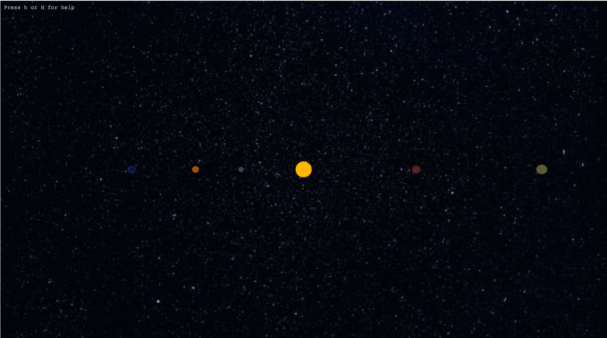
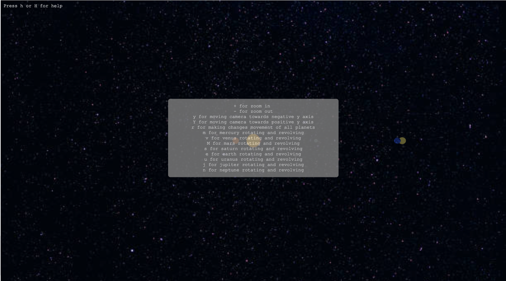
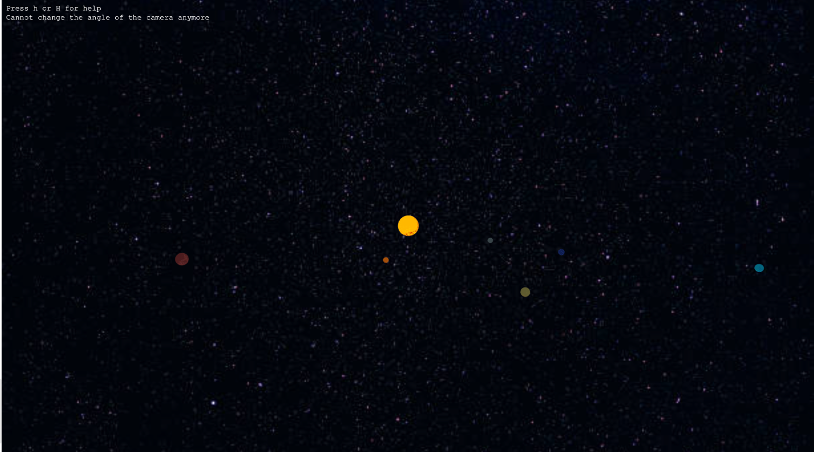
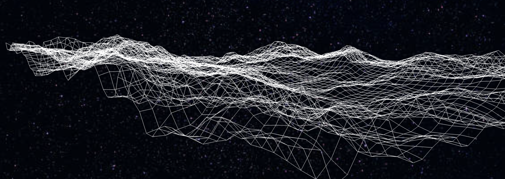
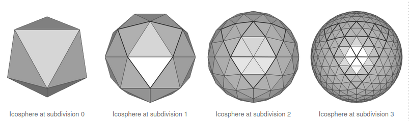

# Solar System Visualization Project

## Concept
Welcome to our **solar system visualization project**! Originally implemented using OpenGL, this project creates a semi-realistic representation of the solar system where the planets rotate and revolve in accurate proportions. The planet's rotation can also be stopped at any moment, providing a dynamic exploration experience. The size of the planets is rendered to scale based on their ratios to the sun. Recently, we transitioned this project to WebGL, enabling it to run seamlessly within web browsers. This transition allows users to interactively explore the solar system directly from their browsers without the need for additional software installations. Additionally, a unique feature of this visualization project allows users to view the planets from different angles by adjusting the camera, enhancing the immersive experience.

## Installation
- Download the Repository
- Run the index.html through a live server

## Screenshots
<div style="display: flex;">
  
  
  
</div>


## Applied Principles
Our solar system implementation incorporates key principles learned in our classes, including transformations, rotations, textures, and lighting.

To create all the planets we just made many copies of our sun and then used transformations and scaling techniques to move them to the correct locations on the screen and change their size of them. 

```javascript
  var earthTranslation = translate(20.0, 0, 0);    // Translating earth away from the sun
  var earthScaling = scale(0.4, 0.4, 0.4);         // Scaling the earth sphere relative to the size of the sun
```

Each planet rotates and revolves in two different ways. They rotate around their own axis and then around the sun at a ratio of their realistic speed. 

```javascript
 if(earthRotationFlag && RotationFlag){              // Checks if the user has turned off the planets rotation and revolution
  earthSunTheta += 0.6;                              // Earth rotation around sun 
  earthRotationTheta = 0.06;                         // Earth planet rotation
  }
  ```


The sequencing of transformations played a crucial role in achieving the desired effects. To enable planetary rotation around the sun, each planet was first relocated to the sun (point of origin) and then rotated around the axis at a specified theta. Subsequently, the planets were repositioned to their original locations. The transformation order is as follows: planets were initially moved to the origin, their sizes were established through scaling, rotation about their own axes was configured, revolution around the sun was set, and finally, the planets were moved back to their correct positions.

```javascript
  // Planets rotation 
  selfRotationMatrix = mult(rotateX(rotationForPlanetTheta), mult(rotateY(rotationForPlanetTheta), rotateZ(rotationForPlanetTheta)));
  
  // Translation to origin
  translationMatrix = translate(-originDistance[0][3], -originDistance[0][2], -originDistance[2][3]);

  // Planets revolution
  rotationMatrix = mult(rotateX(0), mult(rotateY(rotationAroundSunTheta),rotateZ(0)));

  // Translation back to original positin
  reverseTranslationMatrix = translate(originDistance[0][3], originDistance[0][2], originDistance[2][3]);

  // Calculating Model-View Matrix
  modelViewMatrix = mult(reverseTranslationMatrix, mult(translationMatrix, mult(rotationMatrix, mult(selfRotationMatrix, mult   (scalingMatrix, reverseTranslationMatrix)))));
  modelViewMatrix = mult(viewMatrix, modelViewMatrix);
```

## Challenges/Solutions
Our group encountered several challenges during the development process. The first issue that arose came from trying to achieve realistic lighting. When we began adding more planets and textures to those planets, the lighting stopped working entirely. Our solution was to revert back to just the basic lighting to give it a bit of glow to focus more on the textures. The lighting initially was created with a bloom effect to make the light get softer the farther you got away from the sun. This is how we initially calculated the bloom lighting effect:

```javascript
    vec3 N = normalize(vec3(vNormal));
    vec3 L = normalize(lightVertex - gl_FragCoord.xyz);
    vec3 V = normalize(-gl_FragCoord.xyz);
    vec3 H = normalize(L + V);

    vec3 ambient = Ia * vec3(vColor);
    float dfactor = max(dot(N, L), 0.0);
    vec3 diffuse = Id * vec3(vColor) * dfactor;

    float sfactor = pow(max(dot(N, H), 0.0), 4.0 * alpha);
    vec3 specular = Is * vec3(vColor) * sfactor;

    vec3 finalColor = ambient + diffuse + specular;
    finalColor = min(finalColor, vec3(1.0));

    // Bloom effect
    float luminance = dot(finalColor, vec3(0.299, 0.587, 0.114));
    vec3 bloomColor = vec3(1.0, 1.0, 1.0) * pow(luminance, 4.0); // Adjust the intensity as needed

    // Combine original color and bloom
    finalColor += bloomColor;
    fragColor = vec4(finalColor, 1.0);
```


The subsequent significant challenge encountered involved the creation of terrains. Initially, our goal was to enable users to click on a particular planet and seamlessly 'transport' to the planet's surface, experiencing an accurate representation. This approach involved utilizing grayscale representations of the target planets as heightmaps to generate the planetary surface in the form of a grid. The initial step involved constructing a grid to serve as the mesh. Subsequently, the Y values were extracted based on the grayscale, as each pixel stored the height difference perpendicular to the face it represented.



This was then altered to use triangles instead of lines to create a solid surface to which texture could be applied. The reason why this was not applied was because it was difficult to apply texture to the surface, opting for the decision to drop this feature as a team.


Integrating planet-clicking functionality posed several challenges. Each planet received a distinctive ID derived from its initially defined RGBA values. The planetPicker function incorporated an event listener to compute the user's mouse position on the screen and choose the corresponding pixel. Subsequently, the pixel data underwent normalization to the RGBA format [0 - 1], and a comparison ensued with the unique planet IDs to ascertain a match. In the absence of a match with any planet, it signified that the user had selected a different location on the screen.
```javascript
 const pixelX = mouseX * gl.canvas.width / gl.canvas.clientWidth; // Pixel X Location
 const pixelY = gl.canvas.height - mouseY * gl.canvas.height / gl.canvas.clientHeight - 1;  // Pixel Y Location
 planetData = new Uint8Array(4);
 // Reads the color values of a pixel at the specified coordinates
 gl.readPixels(
  pixelX,            // x
  pixelY,            // y
  1,                 // width
  1,                 // height
  gl.RGBA,           // format
  gl.UNSIGNED_BYTE,  // type
  planetData);       // Array to hold the result
  
  // Normalizing the planet pixel colour to [0 - 1] RGBA format
  var normalizedColour = [
    planetData[0] / 255.0 * 2,  // R
    planetData[1] / 255.0 * 2,  // G
    planetData[2] / 255.0 * 2,  // B
    planetData[3] / 255.0       // A
    ];
```
The problem with colour picking arose when textures were applied to the planets. The presence of textures covering the planet's colour interfered with the pixel on the screen. The solution involved redrawing the planets twice: first without lighting and texture on a separate framebuffer, and then on the main buffer, including texture and lighting included. This approach ensured that the colour remained consistent behind the scenes, while users were unaware of the framebuffer in the background.


The next issue resulted from how we built the spheres. One of the most complex aspects about our code is how each sphere is made. Each sphere is made from many different triangles all put together. To build a sphere you pass 4 arrays of points and the subdivision number into the sphere function. It then calls divide triangle based on all of the points passed into the array
```javascript
      function sphere(a, b, c, d, n) {
      divideTriangle(a, b, c, n);
      divideTriangle(d, c, b, n);
      divideTriangle(a, d, b, n);
      divideTriangle(a, c, d, n);
      }
```

Divide triangle then takes every point you passed into it and divides it into many little triangles by recursively calling itself based on the number of times you chose to subdivide the triangles and normalizes each edge.  
```javascript
  function divideTriangle(a, b, c, count) {
      if (count > 0) {
      var ab = mix(a, b, 0.5);
      var ac = mix(a, c, 0.5);
      var bc = mix(b, c, 0.5);
      
      ab = normalize(ab, true);
      ac = normalize(ac, true);
      bc = normalize(bc, true);
      
      divideTriangle(a, ab, ac, count - 1);
      divideTriangle(ab, b, bc, count - 1);
      divideTriangle(bc, c, ac, count - 1);
      divideTriangle(ab, bc, ac, count - 1);
      } else {
      triangle(a, b, c);
      }
      }
```
Then finally once the sphere has subdivided enough it calls triangle to draw the triangle just in case the divide triangle did not divide up the side wrong. This triangle will always be made but is hidden under each side of the sphere made from the triangles in the divide triangle. 

```javascript
 function triangle(a, b, c) {
      positionsArray.push(a);
      positionsArray.push(b);
      positionsArray.push(c);
      
      var t1 = subtract(b, a);
      var t2 = subtract(c, b);
      var normal = normalize(cross(t1, t2));
      normal = vec4(normal[0], normal[1], normal[2], 0.0);
      
      normalsArray.push(normal);
      normalsArray.push(normal);
      normalsArray.push(normal);
      
      index += 3;
      }
```


This code method used is a version of the many subdivision algorithms researched.

Sources
https://academic.oup.com/jcde/article/9/2/826/6573579

https://www.songho.ca/opengl/gl_sphere.html#:~:text=The%20subdivision%20algorithm%20is%20splitting,the%20same%20as%20sphere's%20radius.

https://gamedev.stackexchange.com/questions/31308/algorithm-for-creating-spheres 

And the textbook code examples.


